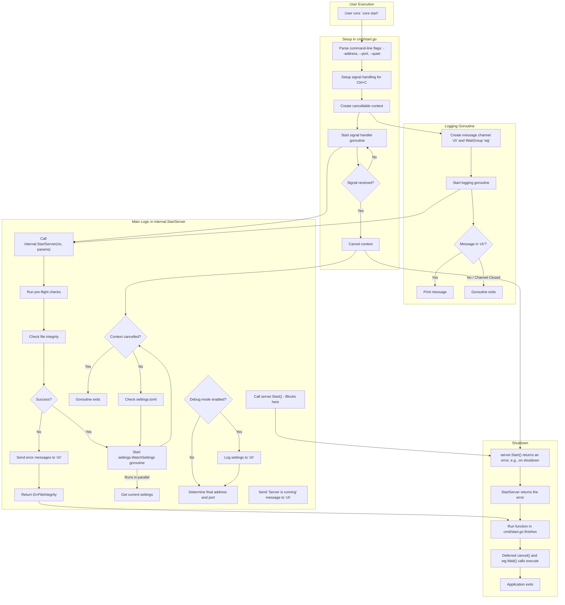

# Start Process Flowchart

This document outlines the sequence of operations for the `start` command, including the setup, execution, and graceful shutdown procedures.

```mermaid
graph TD
    subgraph "User Execution"
        A["User runs `core start`"]
    end

    subgraph "Setup in cmd/start.go"
        B["Parse command-line flags: --address, --port, --quiet"]
        C["Setup signal handling for Ctrl+C"]
        D["Create cancellable context"]
        E["Start signal handler goroutine"] --> F{"Signal received?"};
        F -- Yes --> G["Cancel context"];
        F -- No --> E;
    end

    subgraph "Logging Goroutine"
        H["Create message channel 'ch' and WaitGroup 'wg'"]
        I["Start logging goroutine"] --> J{"Message in 'ch'?"};
        J -- Yes --> K["Print message"];
        J -- No / Channel Closed --> L["Goroutine exits"];
    end

    subgraph "Main Logic in internal.StartServer"
        M["Call internal.StartServer(ctx, params)"]
        N["Run pre-flight checks"]
        O["Check file integrity"] --> P{"Success?"};
        P -- No --> Q["Send error messages to 'ch'"] --> R["Return ErrFileIntegrity"];
        P -- Yes --> S["Start settings.WatchSettings goroutine"];
        S --> T{"Context cancelled?"};
        T -- Yes --> U["Goroutine exits"];
        T -- No --> V["Check settings.toml"] --> S;
        S -- "Runs in parallel" --> W;
        W["Get current settings"]
        X{"Debug mode enabled?"}
        X -- Yes --> Y["Log settings to 'ch'"];
        X -- No --> Z;
        Y --> Z;
        Z["Determine final address and port"]
        AA["Send 'Server is running' message to 'ch'"]
        BB["Call server.Start() - Blocks here"]
    end
    
    subgraph "Shutdown"
        CC["server.Start() returns an error, e.g., on shutdown"]
        DD["StartServer returns the error"]
        EE["Run function in cmd/start.go finishes"]
        FF["Deferred cancel() and wg.Wait() calls execute"]
        GG["Application exits"]
    end

    %% High-Level Flow
    A --> B --> C --> D --> E & H;
    H --> I;
    E & I --> M;
    M --> N --> O;
    R --> EE;
    BB --> CC --> DD --> EE --> FF --> GG;
    G --> T;
    G --> CC;
```
